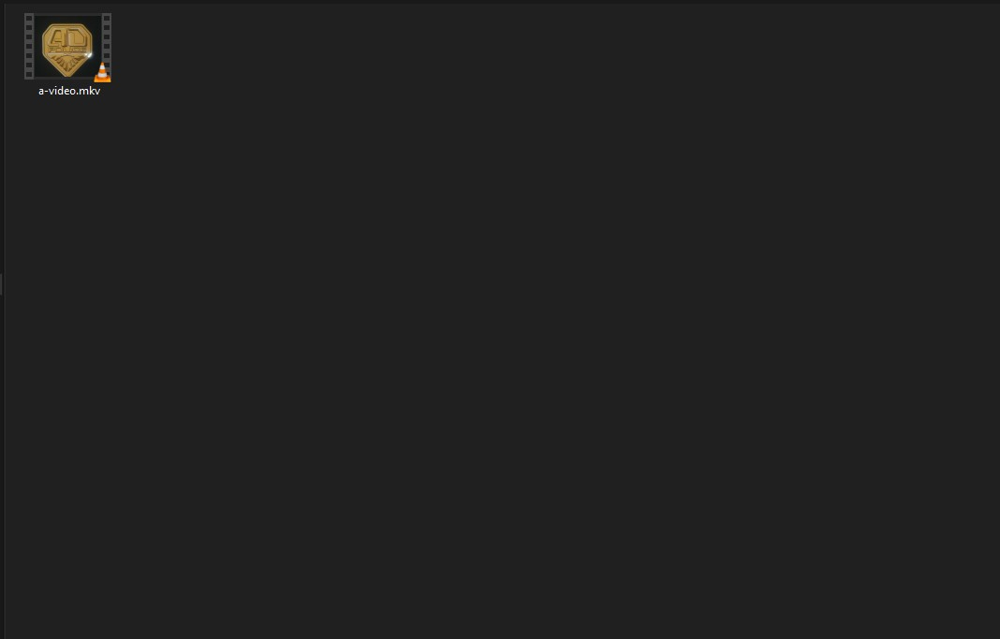

# KiruSlice
CutSlice or SliceSlice I guess.

It's a batch file where if you drag a video file onto it, it'll slice it up into individual scenes.

It's relatively accurate but not perfect. 

You'll likely get some extra unrelated frames at the very end of the clips.

But you'll also get a nice big folder of video files that you can thumb through and find cool scenes.

It's like a shotgun approach to getting clips. Clip 'em all and let god (You) Sort em out.

The possibilities are limitless.

1. Make Cool Gifs

1. Make Anime Music Videos

1. Make Sick Edits to Phonk

1. Weddings Reception Visuals

1. Others

----
# How to use
* Install [ffmpeg](https://ffmpeg.org/download.html) via the package manager of your choice (chocolatey, winget, whatever)
* Download `kiru.bat` from this repository and put it in a directory wherever you want. Or you can clone the repo.
* Drag a video file onto it in the file explorer
* Watch and be amazed
## Tips:
you can adjust the threshold for what it considers a cut by adjusting the `0.7` in `gt(scene,0.7)`(just search for that). Closer to 1 is more lax, closer to 0 is more strict

----
# Requirements
* Windows
* ffmpeg
* A Video File of Vibey 90s Anime 📼

----
# Screenshots
## Before:

----
## After:

----
# Contributing
I'm not great at batch so feel free to make a PR if you have any improvements.
